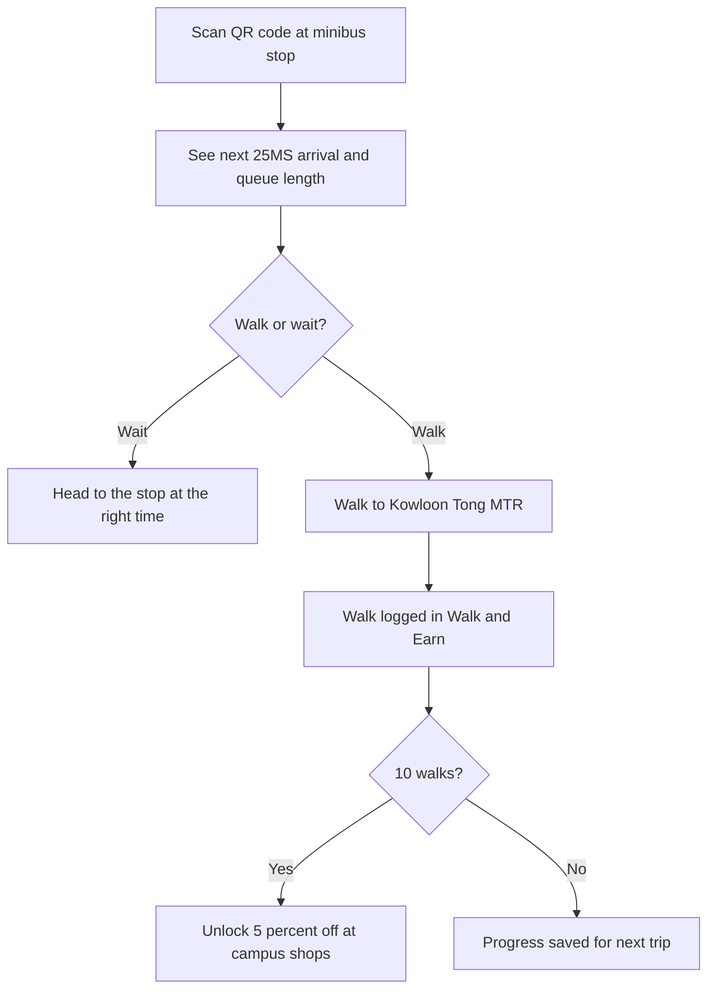

# WalkWise HKBU

**A web app that tells Hong Kong Baptist University students whether to wait for the minibus or walk to the MTR.**

**Live demo:** [vjasonacc.github.io/tvnt1/busi](https://vjasonacc.github.io/tvnt1/busi)

Startup project for BUSI2035 Entrepreneurship and Innovative Thinking at HKBU, Spring 2026. Team of 5.

---

## The problem

There's no MTR station on the HKBU campus. Most students and staff take the 25M or 25MS minibus to Kowloon Tong MTR, but:

- Each minibus has only 19 seats, so at peak hours people often can't get on.
- Arrival times are unpredictable, anywhere from 5 to 20+ minutes.
- There's no way to see how long the queue is before you get to the stop.

So students end up guessing: wait at the stop, or walk 10 to 15 minutes to the station?

## Research

We checked the problem before designing anything:

- **Interviews** with HKBU students and faculty who ride the minibus
- **On-site observation**, timing queues at the campus minibus stops

**What we found:** the average wait is about **10 minutes per trip**, and most people spend it scrolling on their phones because it's too short to study. People still value the minibus on rainy or hot days, so the answer wasn't "just walk." They needed better information to decide.

## The solution

WalkWise is a lightweight mobile web app. There's nothing to download: you scan a QR code at the stop and it opens in your browser.

| Feature | What it does |
| --- | --- |
| **Walk or Wait** | Recommends walking or waiting, based on live minibus arrival times and traffic |
| **Next Arrivals** | Real-time 25MS arrival times from Hong Kong government open data (data.gov.hk) |
| **Queue Sensor (beta)** | Shows queue length at the stop (simulated in the prototype, see decisions below) |
| **Traffic Alerts** | Flags delays on the route, like heavy traffic on Junction Road |
| **Walk & Earn** | Counts your walks. After 10, you unlock 5% off at campus shops |

## User flow

## Key product decisions

- **A web app, not a native app.** Most students won't download a new app to solve a 10-minute wait. A QR code at the stop opens it instantly in the browser, with nothing to install.
- **A recommendation, not just arrival times.** Arrival times alone still leave people guessing. Telling them "walk" or "wait" answers the question they actually have.
- **Simulated queue data in the prototype.** Real queue counts need people-counting sensors at each stop (about HKD 2,400 for 3). We simulated the numbers to test the experience first, before spending money on hardware.
- **Rewarding walking.** Walk & Earn gets people who aren't in a hurry off the 19-seat minibus, freeing seats for people who are, and it's good for their health.
- **Dropping ads as a main revenue source.** We first planned on Google AdSense, then realized most students use ad blockers and a campus-only audience is small. We shifted the focus to university sponsorship and campus vendor partnerships.

## Business model

- **Free for students and staff**
- **Revenue:** HKBU sponsorship, campus vendors paying to be the Walk & Earn reward, and licensing the system to other universities from Year 3
- **Market:** 8,000 to 12,000 HKBU students and staff. We estimated 840 to 900 monthly active users at a 15% conversion rate
- **Costs:** about HKD 5,000 to launch (sensors, hosting, QR signage), projected to be profitable by Year 2

## How I'd measure success

- Average minutes saved per trip, compared to the 10-minute baseline
- Weekly active users, and how many check the app before leaving class
- Share of trips where users follow the Walk or Wait recommendation
- Walk & Earn rewards redeemed at campus shops

## My role

**Product & Research Lead**

- Designed the app concept and core features based on our research
- Mapped the end-to-end user flow with a teammate
- Timed queues on-site at the campus minibus stops and helped run interviews
- Co-wrote the business plan, including the revenue model

## Team and credits

Built by a team of 5 HKBU students. The app was developed by **Pang Lok Him (Jason)**. [See the code here](https://github.com/vjasonacc/tvnt1).
